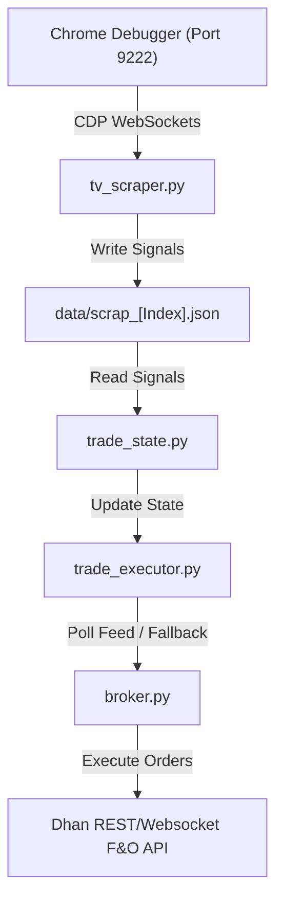

# Index Time Machine: System Architecture & Implementation Guide

This document provides complete guidelines, system architecture details, and modular code structures required to build and maintain the **Index Time Machine** auto-trading application.

---

## 1. System Requirements & Environment

### Prerequisites
* **Python**: `3.10` or higher
* **Google Chrome**: Launched in remote debugging mode to expose the Chrome DevTools Protocol (CDP) port.

### Chrome Launch Flag Configuration
To allow websocket connections from local python instances, close all active Chrome windows and run:
```powershell
Start-Process -FilePath "C:\Program Files\Google\Chrome\Application\chrome.exe" -ArgumentList "--remote-debugging-port=9222", "--remote-allow-origins=*", "--user-data-dir=C:\src\antigravity\IndexTimeMachine\ChromeProfile", "--no-first-run", "--no-default-browser-check", "--disable-search-engine-choice-screen", "--disable-sync"
```

### Python Dependencies (`requirements.txt`)
```text
dhanhq==1.3.1
websocket-client==1.6.1
pandas==2.1.1
numpy==1.26.0
python-dotenv==1.0.0
```

---

## 2. Directory Layout & Organization

All dynamically generated runtime files are categorized in specialized subfolders to keep the workspace root clean:

```text
IndexTimeMachine/
│
├── data/                      # TV Scraper JSON signal data output folder
│   └── scrap_Nifty_50.json    # Overwritten daily with the latest run signals
│
├── lock/                      # Multi-process filesystem instance locks
│   └── .lock_Nifty_50.lock    # Prevents concurrent execution conflicts per index
│
├── logs/                      # Executable stdout & stderr runtime logs
│   ├── log_nifty_50_2026-08-13.log
│   └── ...
│
├── scratch/                   # Local utilities, testing scripts, and offline backtesters
│   └── backtest_today.py      # Offline 1m candles historical backtest simulator
│
├── reports/                   # Visual report dashboard folder
│   ├── extract_trades.py      # New incremental ledger extractor
│   ├── generate_report.py     # Pure dashboard HTML compiler
│   ├── trade_ledger.json      # Central database and source of truth
│   └── index.html             # Compiled interactive dashboard
│
├── trades/                    # Central trade & state data folder
│   ├── trades.json            # Raw trade execution logs
│   └── state_*.json           # Runtime trading state per index
│
├── scripts/                   # Process launcher scripts
│   ├── start_all.sh           # Main VPS environment start script
│   ├── start_all.ps1          # Windows start script
│   ├── start_all.bat          # CMD start script
│   ├── stop_all.sh            # Main VPS stop script
│   ├── start.scrapping.sh     # VPS scraper utility launcher
│   └── cleanup_system.sh      # VPS cache/log cleanup script
│
├── .env                       # Local secrets, Dhan login credentials, and trading mode switches
├── broker.py                  # Dhan API client wrapper, order execution, and auth managers
├── sizing.py                  # Premium margin cost and risk-based lot sizing engine
├── trade_engine.py            # Entry/Exit transaction execution routines
├── trade_executor.py          # Main daemon orchestration loop per index
├── trade_rules.py             # Strategy level calculations and exit conditions checks
├── trade_state.py             # JSON-based trading state load, save, and update layer
├── tv_scraper.py              # WebSocket CDP scraper rotation daemon
└── utils.py                   # Timezone mappings, prints, process locks, and configuration helpers
```

---

## 3. Component Walkthrough & Architecture



### A. Chrome DevTools Scraper (`tv_scraper.py`)
Scrapes active indicators directly from a running TradingView page by establishing a WebSocket connection to the Chrome debugger on port `9222`. 
* **Precision Scraping**: Instead of relying on fragile OCR and pixel alignments, it executes JavaScript inside the tab's DOM to query the `dwgtablecells` container coordinates generated by TradingView's canvas library.
* **Auto-Configuration**: Programmatically parses active indicators. If visual plots or trailing targets are disabled in user settings, it writes instructions to configure the chart dynamically.
* **Overwrites**: Keeps only one entry per calendar day inside the output arrays.

### B. Process Synchronization & Safety (`utils.py`)
* Enforces single-instance execution per index using platform-independent file locking (`msvcrt` on Windows / `fcntl` on Unix/Linux).
* All lock files are written under `lock/` to prevent concurrent execution conflicts.

### C. State Preservation (`trade_state.py`)
* Restores active positions, entry ranges, and targets across restarts from `state_[Index].json`.
* Only performs a full range reset when a signal is loaded from a **different calendar date**. Same-day scraper updates update targets dynamically without disturbing active trades.

### D. Budget-Capped Lot Sizing (`sizing.py`)
* Computes contract lots dynamically based on available margin.
* Constraints: Caps allocations at `80%` of capital (e.g., `80,000 INR` for a `1,00,000 INR` account).
* Scales down lot sizes step-by-step to a minimum of 1 lot if premium requirements exceed the budget constraint.

### E. 5-Level Trailing Stop Loss System (`trade_rules.py`)
* **Initial Targets**: Upon breakout entry, calculates 5 target steps ($T1$ to $T5$) matching multiples of the entry risk ($2 \times \text{Risk}$).
* **Trailing Stop Loss Action**:
  * Evaluated strictly on a **5-minute candle close** basis.
  * If the index closes beyond $T1 \rightarrow$ Stop Loss trails to $T1$ with a buffer.
  * If the index closes beyond $T2 \rightarrow$ Stop Loss trails to $T2$, and so on up to $T4$.
  * **Trailing SL Buffer**: To prevent early noise shakeouts, the actual stop loss level is trailed to `base_sl +/- (original_risk * TM_TRAIL_BUFFER_RATIO)` (where ratio = `0.5`).
  * Exit Target remains locked to $T5$ for final take-profit on a real-time LTP basis.
  * **Spike Guard**: Real-time option P&L check requires `MAX_LOSS_BREACH_THRESHOLD` (2) consecutive ticks below the Max Capital Risk before triggering exit.
  * **Re-entry logic**: Permitted once per cycle after a stop-loss or max-loss exit, but strictly guarded in `trade_executor.py` to ensure signal operator has not changed.
  * Universal Time Exit squares off any remaining open position at `15:25`.

### F. Resilient API Operations (`broker.py` & `trade_engine.py`)
* **Theta Protection**: Skips current-week contract expiries if DTE (Days to Expiry) is $< 3$ calendar days. Automatically selects next week's options contract.
* **Token Self-Healing**: Automatically shares authentications between background index loops by reading and updating `.dhan_token.json` cleanly, preventing concurrency rate limits.
* **Failover Feeds**: If the single allowed client WebSocket connection is busy, automatically falls back to polling the Dhan HTTP REST price feed without crashing.

---

## 4. How to Deploy & Monitor

### 1. Start the Scraper
First, open Chrome in debugging mode, navigate to your TradingView chart with the indicator active, and run the scraper in PowerShell:
```powershell
python tv_scraper.py
```
This runs the background rotation loop and populates the `data/` folder.

### 2. Start the Trade Executors in the Background
Run the executor script for your target index. For example, to run Nifty 50:
```powershell
New-Item -ItemType Directory -Force -Path ".\logs"
Start-Process -NoNewWindow -FilePath ".\venv_314\Scripts\python.exe" -ArgumentList "-u trade_executor.py `"Nifty 50`"" -RedirectStandardOutput "logs\log_Nifty_50.txt" -RedirectStandardError "logs\log_Nifty_50_error.txt" -WorkingDirectory "c:\src\antigravity\IndexTimeMachine"
```

### 3. Monitor Trade Executor Logs
Track stdout messages dynamically:
```powershell
Get-Content .\logs\log_nifty_50_2026-08-13.log -Wait -Tail 20
```
Review final orders inside `trades/trades.json` at market close.

### 4. Running Offline Backtests
To simulate historical trading rules for a specific calendar day:
1. Repopulate target date parameters inside [data/scrap_Nifty_50.json](file:///c:/src/antigravity/IndexTimeMachine/data/scrap_Nifty_50.json). Ensure the `"Timestamp"` field starts with the target date (e.g. `"2026-08-04 11:23:48"`).
2. Execute the simulator script, supplying the date as the first parameter:
   ```powershell
   .\venv_314\Scripts\python.exe scratch\backtest_today.py YYYY-MM-DD
   ```
3. Output traces entry signals, lot allocations, trailing SL checks on 5-minute candle closes, and exit rules.

### 5. Generating Interactive Performance Reports
Compile dynamic, high-end HTML dashboards summarizing daily index trading results:
1. Execute the report generator:
   ```powershell
   .\venv_314\Scripts\python.exe reports/generate_report.py
   ```
2. The compiler first calls `reports/extract_trades.py` to scan new log files, resolves missing option premiums via the Dhan API, and updates the central ledger `reports/trade_ledger.json`. It then compiles the HTML file `reports/index.html`. You can skip log extraction and only compile using the `--skip-extract` flag.
3. Open `reports/index.html` in a local browser to filter executions and drill down into individual trade log segments.

---

## 5. Linux VPS Headless Chrome Setup & Login

Running the scraper directly on a Linux VPS requires launching Chrome in headless mode. Follow these steps to handle installation and session authentication:

### 1. Install Google Chrome on Linux (Ubuntu/Debian)
```bash
wget https://dl.google.com/linux/direct/google-chrome-stable_current_amd64.deb
sudo apt update
sudo apt install ./google-chrome-stable_current_amd64.deb -y
```

### 2. Start Headless Chrome on VPS
Launch Google Chrome in the background with headless flags, remote debugging, and a dedicated profile directory:
```bash
google-chrome --headless=new --remote-debugging-port=9222 --remote-allow-origins="*" --user-data-dir=/root/ChromeProfile --disable-gpu --no-sandbox &
```

### 3. Log In to TradingView (SSH Tunneling Method)
Since Chrome is headless, you cannot view the screen to type credentials directly on the VPS. Instead, route your local browser through the VPS using an SSH tunnel:

1. **Establish the SSH Tunnel**: On your local Windows machine, open PowerShell and run:
   ```powershell
   ssh -N -L 9222:127.0.0.1:9222 user@your_vps_ip
   ```
2. **Access Remote Chrome UI**: Open Chrome locally and navigate to:
   ```text
   http://localhost:9222
   ```
   You will see the list of active tabs running inside the VPS.
3. **Open TradingView & Log In**: Click "Inspect" or create a tab, navigate to `https://www.tradingview.com`, and log in using your account credentials. 
4. **Save & Disconnect**: Once logged in successfully, close your local browser window and exit the SSH tunnel. The login session cookies are now securely stored inside the VPS profile directory `/root/ChromeProfile` forever!
5. **Run the Scraper on VPS**: You can now run `tv_scraper.py` on the VPS; it will start, connect, and naturally be logged in.
